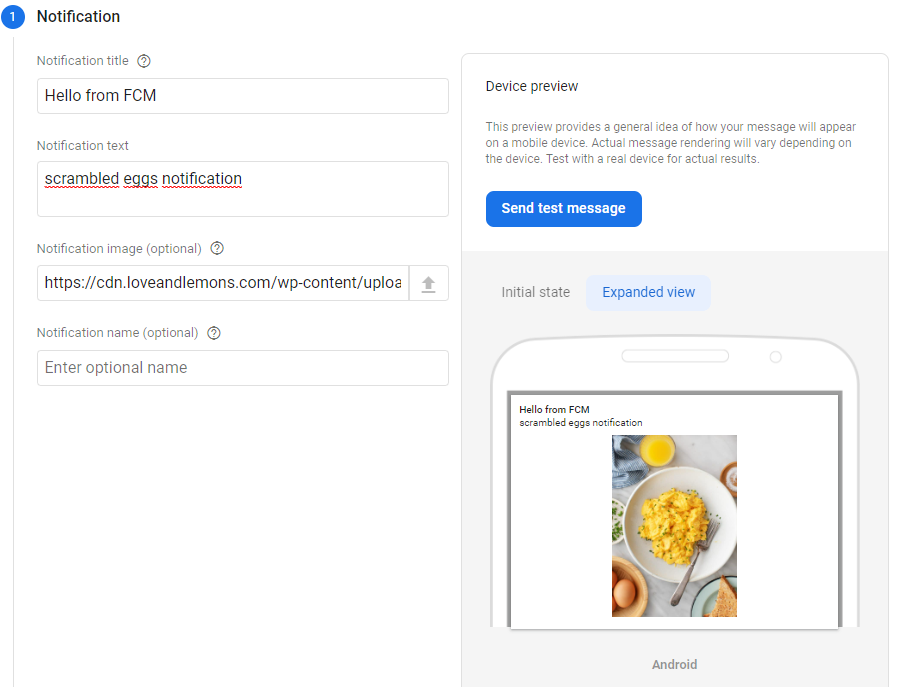

# Egg Timer Notifications 🥚

Project created for the Udacity nanodegree Android Kotlin Developer program.

Upgraded version of the EggTimer that enable Firebase Messaging Service.

EggTimer is a timer app for cooking eggs. You can start and stop the timer, choose different cooking intervals..

## Project Milestones

- Add notifications to the eggtimer app.
- Use channels and importance for the app notifications.
- Customize and style the notifications.

